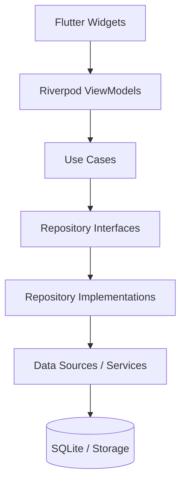

# AURA Architecture Documentation

This document provides a high-level overview of the AURA architecture, following Clean Architecture principles.

## 1. Clean Architecture Layers

AURA is divided into three primary layers:
*   **Presentation Layer**: Contains UI widgets, routing, and Riverpod ViewModels. Handles state management and user interactions.
*   **Domain Layer**: Contains the core business logic, entities, use cases, and repository interfaces. This layer is entirely independent of external frameworks.
*   **Data Layer**: Implements repository interfaces, manages data sources (SQLite, File System, Secure Storage), and handles data transfer objects (Models).

## 2. Dependency Injection Graph

AURA uses a hybrid approach for Dependency Injection:
*   **GetIt**: Acts as a global service locator for singletons, core services, data sources, and repositories (`lib/core/di/injection_container.dart`).
*   **Riverpod**: Wraps GetIt instances to provide reactive state management and UI binding (`lib/core/di/riverpod_providers.dart`).

## 3. Document Viewer Architecture

### Viewer Registry
The `ViewerRegistry` maps files to specific viewer widgets based on their extension. It delegates rendering to specialized wrappers (e.g., `PdfEngineWrapper`, `ImageEngineWrapper`).

### Parser Registry
For text-based documents, the `ParserRegistry` routes parsing requests to specific parsers (`TxtParser`, `DocxParser`). These parsers extract metadata and textual content for the `TextEngineImpl` to render.

## 4. Metadata Flow and Lifecycle

1.  **Import**: Files are copied into the workspace. Basic metadata (name, size, hash) is extracted and stored in `workspace_files` via `WorkspaceRepositoryImpl`.
2.  **Open**: When a file is opened, `document_viewer_viewmodel.dart` triggers `RecentDocumentsService.addRecentDocument()`.
3.  **Update**: This increments `open_count` and updates `last_opened_at` in the SQLite database, which automatically updates the in-memory `MetadataCache`.
4.  **Close**: `saveViewerState()` updates reading progress (page, zoom, scroll) in the database.
5.  **Pin / Favorite**: Users can mark documents as pinned or favorite, updating the boolean flags in the `workspace_files` table.

## 5. Service Responsibilities

*   **DocumentMetadataService**: CRUD operations for document metadata.
*   **RecentDocumentsService**: Manages the "last opened" logic and recent documents queue.
*   **Favorite/PinnedDocumentsService**: Manages user-curated document lists.
*   **FileService**: Handles physical file operations (copy, delete, move).
*   **ThumbnailService**: Generates thumbnails for supported file types.
