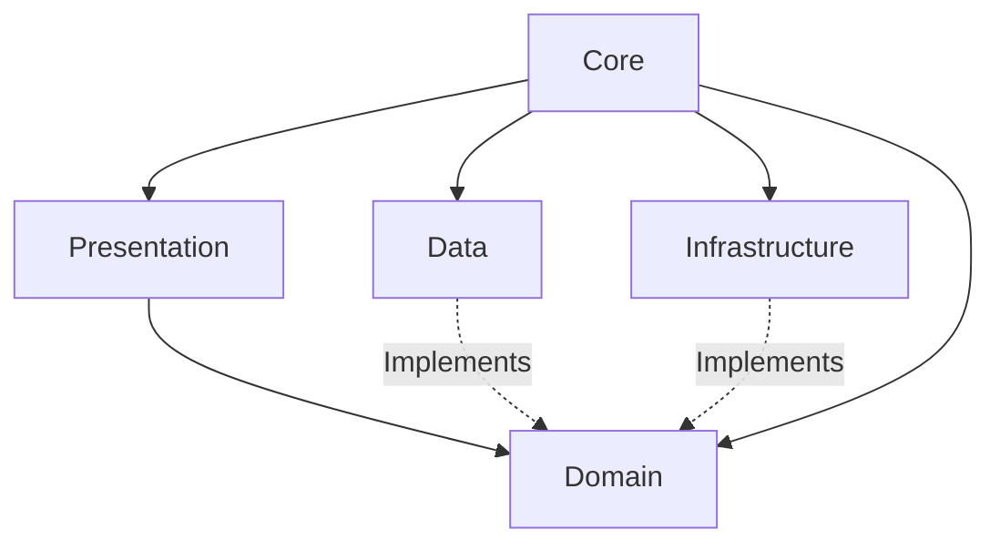
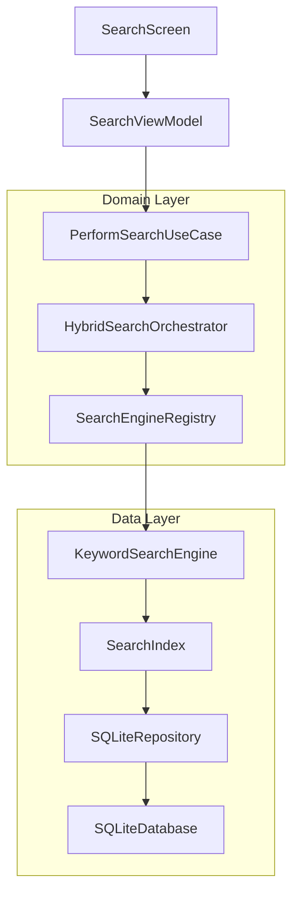
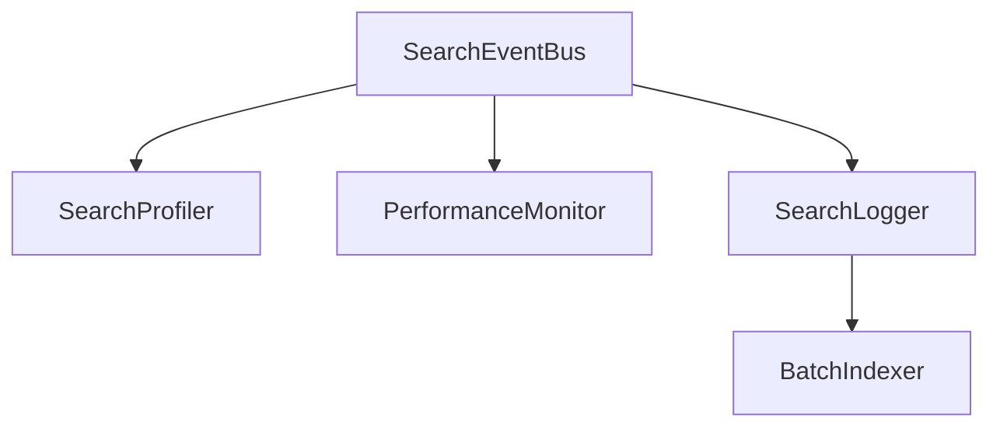

# AURA Architecture Documentation

AURA relies on a meticulously planned software architecture designed for offline-first capabilities, immense scalability, and modular AI integrations.

## Core Paradigms

### Clean Architecture
AURA strictly isolates concerns into well-defined layers, enforcing the Dependency Inversion Principle. The inner layers (Domain) dictate the interfaces, while outer layers (Data, Presentation, Infrastructure) implement them.

- **Domain:** The pure business logic, UseCases, Entities, and repository interfaces. Does not depend on any Flutter or external data packages.
- **Data:** Contains SQLite implementations, REST/API wrappers (if any), device caching, and search engine implementations.
- **Presentation:** Contains Flutter UI, Widgets, and Riverpod State Providers.
- **Core:** Contains shared utilities, theme data, routing, and Dependency Injection configurations.

### MVVM (Model-View-ViewModel)
The Presentation layer utilizes MVVM to cleanly separate the UI (View) from the presentation logic (ViewModel). ViewModels manage the state and invoke Domain UseCases.

### Repository Pattern
All data access (whether SQLite, SharedPreferences, or local filesystem) is abstracted behind Repositories, ensuring that business logic is completely agnostic of data sources.

### State Management & Dependency Injection
- **Riverpod:** Used exclusively for reactive state management, bridging the ViewModels and the UI.
- **GetIt:** Used as the global Service Locator for Dependency Injection, injecting Repositories and UseCases without tightly coupling classes.

## Search Subsystem Architecture

The Search Subsystem is the core feature of the v0.5.0 platform. It introduces a powerful, multi-engine search pipeline.

### Hybrid Search Orchestrator

To future-proof the application for AI implementations, search is mediated by the `HybridSearchOrchestrator`. 

1. **PerformSearchUseCase** takes the query and checks the `SearchCache`.
2. On a cache miss, the UseCase calls the **HybridSearchOrchestrator**.
3. The Orchestrator resolves active search engines via the **SearchEngineRegistry**.
4. Engines (like `KeywordSearchEngine`) run concurrently.
5. An **AbstractMergeStrategy** unifies the disparate scoring algorithms into a single ranked list.

### Parser Registry
Aura supports multiple document types. The `ParserRegistry` dynamically selects the appropriate `AbstractDocumentParser` implementation (e.g., PDF, Markdown, TXT) at runtime to extract raw text and metadata for the Search Index.

## Event Architecture & Observability

To prevent tight coupling between core search operations and diagnostic tools, AURA uses an asynchronous event bus for observability.

This ensures that logging, telemetry, and batch tracking do not block the UI or primary search execution threads.

## Future AI Layer (Phase 6)
The upcoming Phase 6 will introduce `SemanticSearchEngine`, implementing the existing `AbstractSearchEngine`. The `HybridSearchOrchestrator` will merge vector similarity scores (from local embedded ML models) with traditional TF-IDF keyword scores without requiring architectural refactoring.
